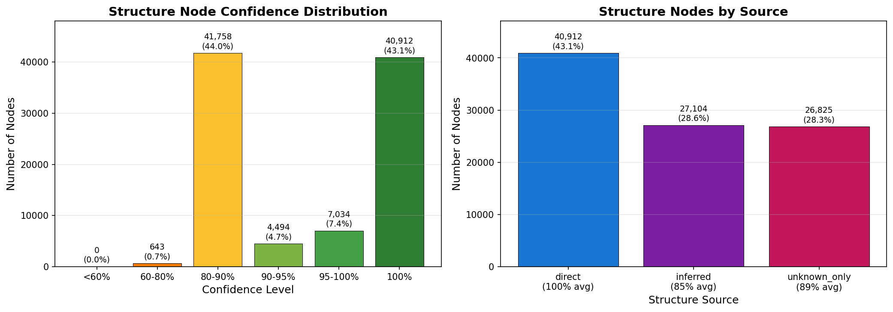

# Textus Receptus Text-Fabric Dataset

A Text-Fabric dataset for the Stephanus 1550 Textus Receptus Greek New Testament with linguistic annotations.

## Why This Dataset?

This dataset combines the TR text with annotations (morphology, semantic domains, glosses) derived from N1904, filling a gap for TR users who want similar tooling to what exists for critical text editions.

| Resource | Text | Morphology | Semantic Domains | Glosses | Syntax Trees |
|----------|------|------------|------------------|---------|--------------|
| MACULA Greek | Nestle 1904 | ✅ | ✅ | ✅ | ✅ |
| Robinson-Pierpont | Byzantine | ✅ | ❌ | ❌ | ❌ |
| **This Dataset** | **TR 1550** | **✅** | **✅** | **✅** | **✅** |

### Hierarchical Structure

This dataset includes clause, phrase, and word group nodes for all verses. Structure is derived from N1904 where possible, with automatic inference for remaining verses:

| Structure Source | Verses | Coverage |
|-----------------|--------|----------|
| Direct transplant (100% word alignment) | 1,812 | 22.8% |
| Inferred (known words, different positions) | 3,214 | 40.4% |
| Generated from word assignments | 2,931 | 36.8% |

**Totals**: 18,850 clauses, 67,357 phrases, 37,354 word groups

#### Confidence Scores

Each structure node has a confidence score (0-1) indicating reliability:



| Confidence Level | Nodes | Percentage |
|-----------------|-------|------------|
| 100% (direct transplant) | 40,912 | 43.1% |
| 95-100% | 7,034 | 7.4% |
| 90-95% | 4,494 | 4.7% |
| 80-90% | 41,758 | 44.0% |
| 60-80% | 643 | 0.7% |
| <60% | 0 | 0.0% |

**How confidence is calculated:**

| Source | Method | Confidence |
|--------|--------|------------|
| Direct | 100% word alignment with N1904 | 100% |
| Inferred | Word appears in N1904 with known function | 85% |
| Unknown | Elision mapping (ἀλλ᾽ → ἀλλά) | 95% |
| Unknown | Strong's number lookup | 85-90% |
| Unknown | Capitalized proper name | 85% |
| Unknown | Morphology inference (N-* → NP) | 75-90% |

Phrase type accuracy: 84.8% consistent (phrase type matches POS of contained words).

## Disclaimer

This dataset is a derivative work, not original academic scholarship. The annotations are transplanted from the [N1904 dataset](https://github.com/CenterBLC/N1904), which was created by biblical scholars at the Center for Biblical Languages and Computing. The author of this repository is not a biblical scholar. This dataset is provided for convenience and experimentation; please use it with discretion and verify findings against authoritative sources when accuracy matters.

### Limitations Compared to N1904

| Feature | Direct Transplant (23%) | Inferred/Generated (77%) |
|---------|------------------------|--------------------------|
| Word annotations (lemma, morph, gloss) | ✅ Full N1904 quality | ✅ NLP + lexicon |
| Phrase boundaries | ✅ From N1904 | ✅ Generated from POS |
| Phrase types (NP, VP, PP) | ✅ From N1904 | ✅ Inferred from POS |
| Phrase functions (Subj, Pred, Objc) | ✅ From N1904 | ⚠️ Partial |
| Clause boundaries | ✅ From N1904 | ✅ Generated from conjunctions |
| Clause types (content, purpose, conditional) | ✅ From N1904 | ⚠️ Basic types only |
| Phrase relations (rela) | ✅ From N1904 | ❌ Not generated |
| Word groups | ✅ From N1904 | ✅ DetNP, PrepNp, NPofNP patterns |
| Nested hierarchy | ✅ From N1904 | ❌ Flat structure |

**Bottom line**: For the 23% of verses with direct transplant, you get full N1904-equivalent structure. For the remaining 77%, you get word-level annotations, phrase groupings, clause boundaries, and word group patterns - sufficient for most text analysis but without the deep hierarchical nesting that N1904 provides.

#### Generated Structure Accuracy

The generated structure (for the 77% non-direct verses) is **simpler but not incorrect**. Comparison with N1904:

| Pattern | Coverage | Notes |
|---------|----------|-------|
| PrepNp | 78.6% | Preposition + NP groups |
| DetNP | 49.7% | Article + noun groups |
| AdjpNp/NpAdjp | ~33% | Adjective-noun patterns |
| Clauses | ~44% | Fewer divisions (2.4 vs 5.4 per verse) |

The generated structures are valid - N1904 simply provides finer granularity:
- **TR generated clauses**: Split at conjunctions and subordinators
- **N1904 clauses**: Also split at every finite verb
- **TR generated word groups**: Flat patterns (DetNP, PrepNp)
- **N1904 word groups**: Hierarchical nesting (3-5 levels deep)

For syntactic analysis requiring N1904-level detail, filter to `structure_source=direct`.

## Overview

This project creates an annotated Text-Fabric dataset for the TR using a "Graft and Patch" strategy:

- **~89% of words**: Annotations transplanted from the aligned N1904 dataset
- **~11% of words**: Annotations generated via NLP + lexicon lookup (for TR-only variants)

### Dataset Statistics

| Metric | Value |
|--------|-------|
| Total words | 140,726 |
| Total verses | 7,957 |
| Books | 27 (complete NT) |
| Clauses | 18,850 |
| Phrases | 67,357 |
| Word groups | 37,354 |
| **Total nodes** | **272,531** |
| Unique lemmas | 7,943 |
| Word annotations from N1904 | 88.8% |
| Word annotations from NLP | 11.2% |

### High-Profile TR Variants Included

- Comma Johanneum (1 John 5:7-8)
- Eunuch's Confession (Acts 8:37)
- Pericope Adulterae (John 7:53-8:11)
- Longer Ending of Mark (Mark 16:9-20)
- Lord's Prayer Doxology (Matthew 6:13)

## Requirements

```bash
pip install -r requirements.txt
```

Key dependencies:
- Python 3.9+
- pandas
- text-fabric
- stanza (for NLP parsing)
- requests, beautifulsoup4 (for BLB download)

## Project Structure

```
tr/
├── config.yaml           # Pipeline configuration
├── run_pipeline.py       # Main pipeline runner
├── requirements.txt      # Python dependencies
├── scripts/
│   ├── download_blb_tr.py    # Download TR from Blue Letter Bible
│   ├── compare_tr_n1904.py   # Validation script
│   ├── phase1/               # Data acquisition
│   ├── phase2/               # Alignment & syntax transplant
│   ├── phase3/               # NLP for gaps
│   ├── phase4/               # Text-Fabric generation
│   ├── phase5/               # Quality assurance
│   └── utils/                # Shared utilities
├── data/
│   ├── source/               # Raw input data
│   ├── intermediate/         # Pipeline working files
│   └── output/               # Final TF dataset & reports
└── logs/                     # Pipeline execution logs
```

## Usage

### Running the Full Pipeline

```bash
python run_pipeline.py
```

Or run specific phases:

```bash
python run_pipeline.py --phase 2    # Run only Phase 2
python run_pipeline.py --from 3     # Run from Phase 3 onwards
python run_pipeline.py --dry-run    # Preview without executing
```

### Downloading Fresh TR Data

To download the TR from Blue Letter Bible (with caching):

```bash
python scripts/download_blb_tr.py          # Uses cache if available
python scripts/download_blb_tr.py --fresh  # Ignore cache, re-download everything
python scripts/download_blb_tr.py --clear-cache  # Delete cached HTML files
```

HTML pages are cached in `data/source/blb_cache/` to avoid re-scraping on subsequent runs.

### Validating Against N1904

```bash
python scripts/compare_tr_n1904.py
```

## Pipeline Phases

### Phase 1: Data Acquisition
- Download/load TR source text
- Download/load N1904 Text-Fabric dataset
- Validate source data

### Phase 2: Alignment & Syntax Transplant
- Align TR verses with N1904 verses
- Match words between aligned verses
- Transplant syntactic annotations from N1904 to TR

### Phase 3: NLP Gap Filling
- Identify words without transplanted syntax (TR-only variants)
- Parse with Stanza NLP
- Map Universal Dependencies labels to N1904 format

### Phase 4: Text-Fabric Generation
- Merge aligned and NLP-parsed data
- Fill glosses to achieve 100% coverage
- Fix systematic NLP errors (lemma/POS corrections using N1904 reference)
- Generate TF node features (word, lemma, pos, case, etc.)
- Generate TF edge features (parent relationships)
- Build container nodes (book, chapter, verse)
- **Structure transplant**: Classify verses, transplant clause/phrase/wg nodes from N1904
- **Structure inference**: Resolve unknown word forms, integrate structure into TF

### Phase 5: Quality Assurance
- Check for cycles in syntax trees
- Verify orphan nodes
- Validate feature completeness
- Spot-check high-profile variants
- Generate QA report

## Configuration

Edit `config.yaml` to customize:

- Data paths
- Alignment thresholds
- NLP settings
- Output features
- QA thresholds

## Data Sources

- **TR Text**: Stephanus 1550 from [Blue Letter Bible](https://www.blueletterbible.org/)
- **N1904 Syntax**: [CenterBLC/N1904](https://github.com/CenterBLC/N1904) Text-Fabric dataset

## Output

The final Text-Fabric dataset is generated in `data/output/tf/` with features including:

**Word Features:**

| Feature | Description | Coverage |
|---------|-------------|----------|
| unicode | Surface form (Greek) | 100% |
| text | Surface form (alias) | 100% |
| normalized | Unicode NFC normalized | 100% |
| lemma | Dictionary form | 100% |
| sp | Part of speech | 100% |
| cls | Word class (noun/verb/adj) | 100% |
| strong | Strong's number | 100% |
| morph | Morphology code | 100% |
| function | Syntactic function | 41% |
| role | Syntactic role (s/o/v/etc) | 76% |
| case | Grammatical case | 57% |
| gloss | English gloss | 100% |
| translit | Latin transliteration | 100% |
| lemmatranslit | Lemma transliteration | 100% |
| unaccent | Greek without diacritics | 100% |
| after | Trailing punctuation/space | 100% |
| trailer | Trailing material (alias) | 100% |
| ln | Louw-Nida semantic domains | 97% |
| bookshort | Book abbreviation (MAT) | 100% |
| num | Word position in verse | 100% |
| ref | Reference string (MAT 1:1!1) | 100% |
| id | Unique word ID | 100% |
| trans | Contextual translation | 97% |
| domain | Semantic domain codes | 90% |
| typems | Morphological subtype | 32% |

**Structure Features (clause/phrase/wg nodes):**

| Feature | Description |
|---------|-------------|
| typ | Phrase/clause type (NP, PP, VP) |
| function | Syntactic function (Subj, Pred, Objc, Cmpl) |
| rela | Relation to context |
| rule | Word group syntactic rule |
| clausetype | Clause type |
| structure_source | Origin: direct/inferred |
| structure_confidence | Confidence score (0-1) |

### Gloss Coverage

100% gloss coverage is achieved automatically as part of Phase 4:

```bash
# Just run the pipeline - glosses are filled automatically
python run_pipeline.py
```

| Source | Coverage |
|--------|----------|
| N1904 aligned | 88.8% |
| N1904 + lexicon lookup | 97.9% |
| Manual glosses + fallbacks | 100% |

See [docs/GLOSS_COVERAGE.md](docs/GLOSS_COVERAGE.md) for details.

## Using the Dataset

Load the dataset with Text-Fabric:

```python
from tf.fabric import Fabric

TF = Fabric(locations='data/output/tf')
api = TF.load('unicode lemma sp function typ')
F, T, L = api.F, api.T, api.L

# Navigate to a verse
verse = T.nodeFromSection(('I_Corinthians', 1, 5))
words = L.d(verse, otype='w')
print(f"Verse has {len(words)} words")

# Get word annotations
for w in words[:5]:
    print(f"{F.unicode.v(w)} - {F.lemma.v(w)} ({F.sp.v(w)})")

# Navigate structure (for verses with transplanted structure)
for w in words:
    phrases = L.u(w, otype='phrase')
    if phrases:
        p = phrases[0]
        print(f"Word '{F.unicode.v(w)}' in phrase with function: {F.function.v(p)}")
```

### Node Types

| Type | Count | Description |
|------|-------|-------------|
| w | 140,726 | Word (slot) nodes |
| verse | 7,957 | Verse containers |
| chapter | 260 | Chapter containers |
| book | 27 | Book containers |
| clause | 18,850 | Clause structure |
| phrase | 67,357 | Phrase structure |
| wg | 37,354 | Word group structure |

## License

MIT License. See [LICENSE](LICENSE) for details.
